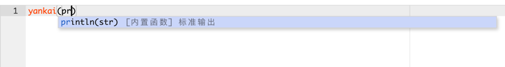

# react-ace-custom-mode-theme-demo

This project was bootstrapped with [Create React App](https://github.com/facebook/create-react-app).

A simple approach for customizing react-ace editor with **your own mode and theme** in react function component.

自定义react-ace代码编辑器，使用你自己的语言模式和主题！！（React 函数式组件实现）一个简单的实现。

## situation

1. react: ^18.2.0
2. react-dom: ^18.2.0
3. react-ace: ^10.1.0
4. function component

## Available Scripts

In the project directory, you can run:

### `npm start`

Runs the app in the development mode.\
Open [http://localhost:3000](http://localhost:3000) to view it in your browser.

The page will reload when you make changes.\
You may also see any lint errors in the console.
